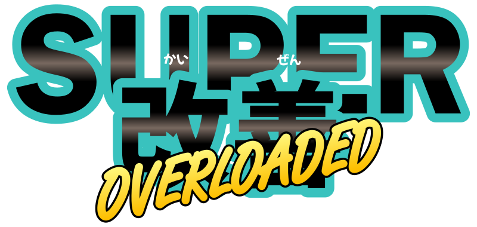
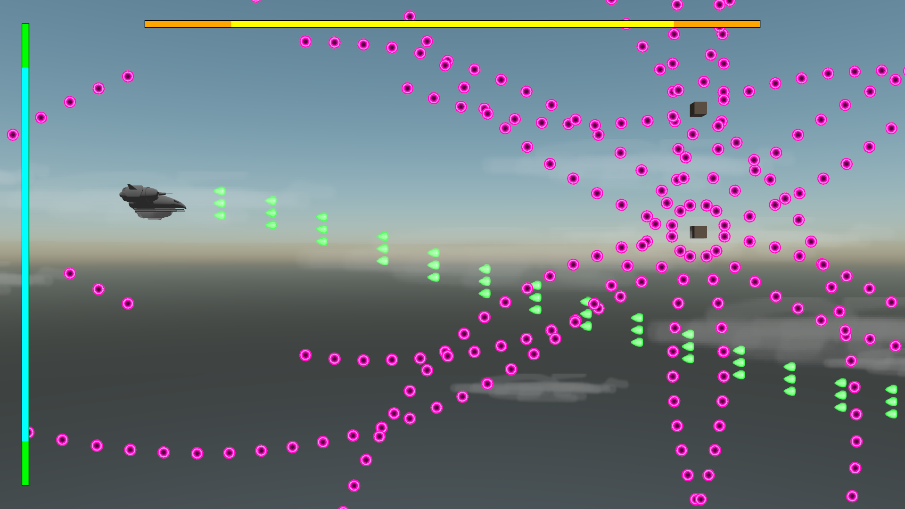

# ☄ Super Kaizen _Overloaded_ ☄

<!--  -->
<!--  -->

**☄ Super Kaizen _Overloaded_ ☄** is a shoot'em up written in 🦀 Rust with the 🕊 Bevy game engine.

This is an official entry for the first Bevy Game Jam, under the theme **unfair advantage**.

